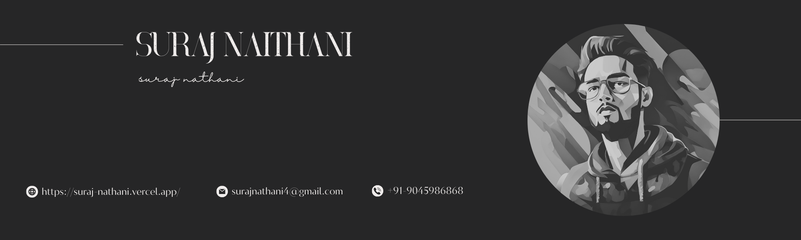

###

<h1 align="left">Hey  What's up?</h1>

###

My name is Suraj Naithani and I'm a Full Stack Web Developer.

- <i>Currently:</i> MCA Student at Graphic Era Hill University in Dehradun. 
- <i>Previously:</i> BCA Student at Graphic Era Hill University in Dehradun.

###

## About me⚡

I'm a versatile Full-Stack Web Developer and React Native Developer, skilled in creating dynamic web apps, secure management systems, and engaging mobile applications. Passionate about exploring new technologies, I leverage innovative stacks to build impactful solutions. I also enjoy playing chess, listening to music, and exploring nature outdoors.

### 🧐 More About Me:

- 📝 &nbsp; Check out my **[Resume](https://drive.google.com/file/d/1F7r0LIDsN5JAWnPH5CbwiQ4Dj2BOf2ja/view?usp=sharing)**
- 🔭 &nbsp; I’m currently working on **Online booking appointment web app**
- 🌱 &nbsp; I’m currently learning Web socket.io 

###

## Skill Set :muscle:

These are some of the major technologies that I use or have worked on in the past:

**Programming Languages**

  
  
  
  

&nbsp;

**Libraries and Frameworks**

  
  
  
  
  
  
  
  
  
  
  

&nbsp;

**Databases**

 
  
  

&nbsp;

**Tools**

 
  
  
  
  
  
  
  
  
  

&nbsp;

###

## Let's Connect :handshake:

  
  
  
  
  
  

###

 <!--- 

   

 ---> 

 <!--- 
 
 ---> 
